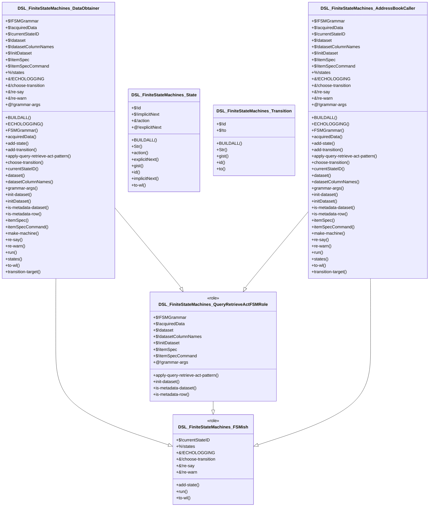

# Raku DSL::FiniteStateMachines
    
[](https://opensource.org/licenses/Artistic-2.0)

## In brief

This repository is for a Raku package with class definitions and functions for 
creation of Finite State Machines (FSMs) and their execution.

-----

## Usage example (Address book)

Here we load the definition of the class `AddressBookCaller` (provided by this package)
and related entities package, 
["DSL::Entity::AddressBook"](https://github.com/antononcube/Raku-DSL-Entity-AddressBook):

```perl6
use DSL::FiniteStateMachines::AddressBookCaller;

use DSL::Entity::AddressBook;
use DSL::Entity::AddressBook::ResourceAccess;
```

Here we obtain a resource object to access a (particular) address book:

```perl6
my $resourceObj = DSL::Entity::AddressBook::resource-access-object();
```

Here we create the FSM and show its states:

```perl6
my DSL::FiniteStateMachines::AddressBookCaller $abcFSM .= new;

$abcFSM.make-machine(($resourceObj,));

.say for $abcFSM.states;
```

(Each pair shows the name of the state object and the object itself.)

Here is the graph of FSM's state transition:

```perl6, output.prompt=NONE, output-lang=mermaid
$abcFSM.to-mermaid-js
```

Here is how the dataset of the create FSM looks like:

```perl6
.say for $abcFSM.dataset.pick(3);
```

For an *interactive* execution of the FSM we use the command:

```
#$abcFSM.run('WaitForCallCommand');
```

Here we *run* the FSM with a sequence of commands:

```perl6
$abcFSM.run('WaitForCallCommand', 
        ["call an actor from LOTR", "", 
         "take last three", "", 
         "take the second", "", "", 
         "2", "5", "", 
         "quit"]);
```

------

## Object Oriented Design

Here is the Unified Modeling Language (UML) diagram corresponding to the classes in this package:



(The [UML spec](./docs/UML-class-diagram.puml) and the Mermaid spec above were automatically generated with ["UML::Translators"](https://raku.land/zef:antononcube/UML::Translators), [AAp5].)

Here is the MermaidJS spec generation shell command:

```
to-uml-spec --format=MermaidJS DSL::FiniteStateMachines 
```

------

## References

### Packages

[AAp1] Anton Antonov,
[DSL::Shared Raku package](https://github.com/antononcube/Raku-DSL-Shared),
(2020),
[GitHub/antononcube](https://github.com/antononcube).

[AAp2] Anton Antonov,
[DSL::Entity::Metadata Raku package](https://github.com/antononcube/Raku-DSL-Entity-Metadata),
(2021),
[GitHub/antononcube](https://github.com/antononcube).

[AAp3] Anton Antonov,
[DSL::English::DataAcquisitionWorkflows Raku package](https://github.com/antononcube/Raku-DSL-English-DataAcquisitionWorkflows),
(2021),
[GitHub/antononcube](https://github.com/antononcube).

[AAp4] Anton Antonov,
[DSL::Entity::AddressBook Raku package](https://github.com/antononcube/Raku-DSL-Entity-AddressBook),
(2023),
[GitHub/antononcube](https://github.com/antononcube).

[AAp5] Anton Antonov,
[UML::Translators Raku package](https://github.com/antononcube/Raku-UML-Translators),
(2021),
[GitHub/antononcube](https://github.com/antononcube).

### Videos

[AAv1] Anton Antonov,
["Multi-language Data Wrangling and Acquisition Conversational Agents (in Raku)"](https://www.youtube.com/watch?v=3OUkSa-5vEk),
(2021),
[YouTube.com](https://www.youtube.com/channel/UC5qMPIsJeztfARXWdIw3Xzw).