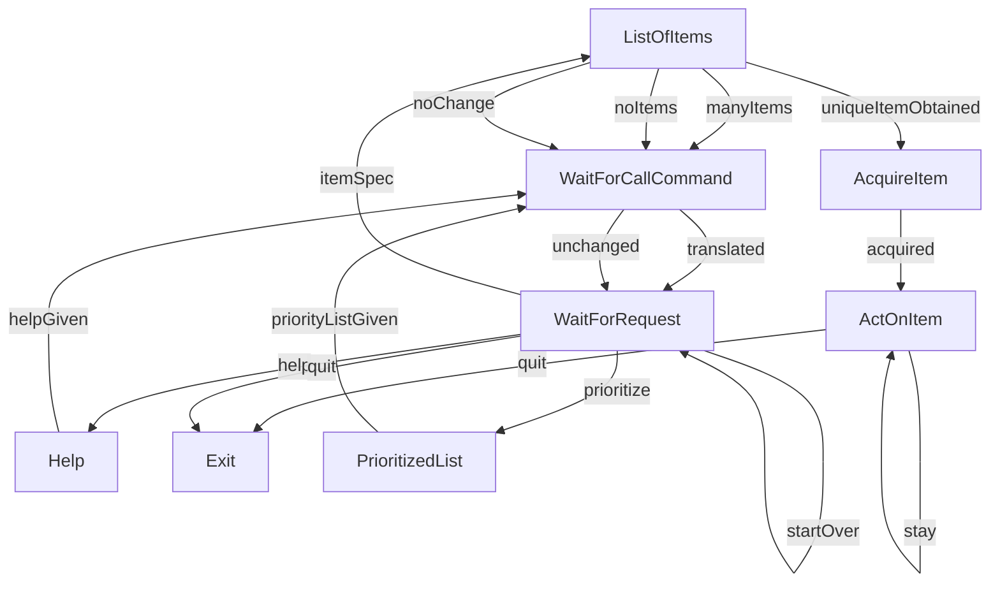

# Raku DSL::FiniteStateMachines
    
[](https://opensource.org/licenses/Artistic-2.0)

## In brief

This repository is for a Raku package with class definitions and functions for 
creation of Finite State Machines (FSMs) and their execution.

-----

## Usage example (Address book)

Here we load the definition of the class `AddressBookCaller` (provided by this package)
and related entities package, 
["DSL::Entity::AddressBook"](https://github.com/antononcube/Raku-DSL-Entity-AddressBook):

```perl6
use DSL::FiniteStateMachines::AddressBookCaller;

use DSL::Entity::AddressBook;
use DSL::Entity::AddressBook::ResourceAccess;
```
```
# (Any)
```

Here we obtain a resource object to access a (particular) address book:

```perl6
my $resourceObj = DSL::Entity::AddressBook::resource-access-object();
```
```
# DSL::Entity::AddressBook::ResourceAccess.new
```

Here we create the FSM and show its states:

```perl6
my DSL::FiniteStateMachines::AddressBookCaller $abcFSM .= new;

$abcFSM.make-machine(($resourceObj,));

.say for $abcFSM.states;
```
```
# ListOfItems => State object < id => ListOfItems, action => -> $obj { #`(Block|2947544965080) ... } >
# Help => State object < id => Help, action => -> $obj { #`(Block|2947544965152) ... } >
# ActOnItem => State object < id => ActOnItem, action => -> $obj { #`(Block|2947544965224) ... } >
# PrioritizedList => State object < id => PrioritizedList, action => -> $obj { #`(Block|2947544965296) ... } >
# WaitForCallCommand => State object < id => WaitForCallCommand, action => -> $obj { #`(Block|2947544965368) ... } >
# WaitForRequest => State object < id => WaitForRequest, action => -> $obj { #`(Block|2947544965440) ... } >
# AcquireItem => State object < id => AcquireItem, action => -> $obj { #`(Block|2947544965512) ... } >
# Exit => State object < id => Exit, action => -> $obj { #`(Block|2947544965584) ... } >
```

(Each pair shows the name of the state object and the object itself.)

Here is the graph of FSM's state transition:

```perl6, output.prompt=NONE, output-lang=mermaid
$abcFSM.to-mermaid-js
```


Here is how the dataset of the create FSM looks like:

```perl6
.say for $abcFSM.dataset.pick(3);
```
```
# {Company => X-Men, DiscordHandle => ralph.winter#4709, Email => ralph.winter1419@aol.net, Name => Ralph Winter, Phone => 652-415-1269, Position => producer}
# {Company => X-Men, DiscordHandle => bryan.singer#1067, Email => bryan.singer1916@icloud.com, Name => Bryan Singer, Phone => 422-832-5218, Position => director}
# {Company => X-Men, DiscordHandle => bryan.singer#5801, Email => bryan.singer.22@gmail.com, Name => Bryan Singer, Phone => 422-832-5218, Position => producer}
```

For an *interactive* execution of the FSM we use the command:

```
#$abcFSM.run('WaitForCallCommand');
```

Here we *run* the FSM with a sequence of commands:

```perl6
$abcFSM.run('WaitForCallCommand', 
        ["call an actor from LOTR", "", 
         "take last three", "", 
         "take the second", "", "", 
         "2", "5", "", 
         "quit"]);
```
```
# 🔊 PLEASE enter call request.
# ⚙️Input: ⚙️"call an actor from LOTR"
# ⚙️Translated input: ⚙️filter by Position is "actor" and Company is "LOTR"
# 🔊 LISTING items.
# ⚙️ListOfItems: Obtained the records:
# ⚙️+----------------------+-----------------+----------+---------+--------------------------------+--------------+
# ⚙️|    DiscordHandle     |       Name      | Position | Company |             Email              |    Phone     |
# ⚙️+----------------------+-----------------+----------+---------+--------------------------------+--------------+
# ⚙️|   andy.serkis#8484   |   Andy Serkis   |  actor   |   LOTR  |   andy.serkis.981@gmail.com    | 408-573-4472 |
# ⚙️|   elijah.wood#7282   |   Elijah Wood   |  actor   |   LOTR  |     elijah.wood.53@aol.com     | 321-985-9291 |
# ⚙️|  ian.mckellen#9077   |   Ian McKellen  |  actor   |   LOTR  |    ian.mckellen581@aol.com     | 298-517-5842 |
# ⚙️|    liv.tyler#8284    |    Liv Tyler    |  actor   |   LOTR  |    liv.tyler1177@gmail.com     | 608-925-5727 |
# ⚙️|  orlando.bloom#6219  |  Orlando Bloom  |  actor   |   LOTR  |  orlando.bloom.914@gmail.net   | 570-406-4260 |
# ⚙️|   sean.astin#1753    |    Sean Astin   |  actor   |   LOTR  |   sean.astin.1852@gmail.net    | 365-119-3172 |
# ⚙️| viggo.mortensen#7157 | Viggo Mortensen |  actor   |   LOTR  | viggo.mortensen1293@icloud.com | 287-691-8138 |
# ⚙️+----------------------+-----------------+----------+---------+--------------------------------+--------------+
# 🔊 PLEASE enter call request.
# ⚙️Input: ⚙️"take last three"
# 🔊 LISTING items.
# ⚙️ListOfItems: Obtained the records:
# ⚙️+----------+--------------------------------+----------------------+---------+-----------------+--------------+
# ⚙️| Position |             Email              |    DiscordHandle     | Company |       Name      |    Phone     |
# ⚙️+----------+--------------------------------+----------------------+---------+-----------------+--------------+
# ⚙️|  actor   |  orlando.bloom.914@gmail.net   |  orlando.bloom#6219  |   LOTR  |  Orlando Bloom  | 570-406-4260 |
# ⚙️|  actor   |   sean.astin.1852@gmail.net    |   sean.astin#1753    |   LOTR  |    Sean Astin   | 365-119-3172 |
# ⚙️|  actor   | viggo.mortensen1293@icloud.com | viggo.mortensen#7157 |   LOTR  | Viggo Mortensen | 287-691-8138 |
# ⚙️+----------+--------------------------------+----------------------+---------+-----------------+--------------+
# 🔊 PLEASE enter call request.
# ⚙️Input: ⚙️"take the second"
# 🔊 LISTING items.
# ⚙️ListOfItems: Obtained the records:
# ⚙️+-----------------+------------+--------------+---------+----------+---------------------------+
# ⚙️|  DiscordHandle  |    Name    |    Phone     | Company | Position |           Email           |
# ⚙️+-----------------+------------+--------------+---------+----------+---------------------------+
# ⚙️| sean.astin#1753 | Sean Astin | 365-119-3172 |   LOTR  |  actor   | sean.astin.1852@gmail.net |
# ⚙️+-----------------+------------+--------------+---------+----------+---------------------------+
# 🔊 ACQUIRE item: {Company => LOTR, DiscordHandle => sean.astin#1753, Email => sean.astin.1852@gmail.net, Name => Sean Astin, Phone => 365-119-3172, Position => actor}
# ⚙️Acquiring contact info for : ⚙️Sean Astin
# 🔊 ACT ON item: {Company => LOTR, DiscordHandle => sean.astin#1753, Email => sean.astin.1852@gmail.net, Name => Sean Astin, Phone => 365-119-3172, Position => actor}
# ⚙️[1] email, [2] phone message, [3] phone call, [4] discord message, or [5] nothing
# ⚙️(choose one...)
# ⚙️Input: ⚙️"2"
# ⚙️message by phone 365-119-3172
# 🔊 ACT ON item: {Company => LOTR, DiscordHandle => sean.astin#1753, Email => sean.astin.1852@gmail.net, Name => Sean Astin, Phone => 365-119-3172, Position => actor}
# ⚙️[1] email, [2] phone message, [3] phone call, [4] discord message, or [5] nothing
# ⚙️(choose one...)
# ⚙️Input: ⚙️"5"
# ⚙️do nothing
# 🔊 SHUTTING down...
```

------

## Object Oriented Design

Here is the Unified Modeling Language (UML) diagram corresponding to the classes in this package:


(The [UML spec](./docs/UML-class-diagram.puml) and the Mermaid spec above were automatically generated with ["UML::Translators"](https://raku.land/zef:antononcube/UML::Translators), [AAp5].)

Here is the MermaidJS spec generation shell command:

```
to-uml-spec --format=MermaidJS DSL::FiniteStateMachines 
```

------

## References

### Packages

[AAp1] Anton Antonov,
[DSL::Shared Raku package](https://github.com/antononcube/Raku-DSL-Shared),
(2020),
[GitHub/antononcube](https://github.com/antononcube).

[AAp2] Anton Antonov,
[DSL::Entity::Metadata Raku package](https://github.com/antononcube/Raku-DSL-Entity-Metadata),
(2021),
[GitHub/antononcube](https://github.com/antononcube).

[AAp3] Anton Antonov,
[DSL::English::DataAcquisitionWorkflows Raku package](https://github.com/antononcube/Raku-DSL-English-DataAcquisitionWorkflows),
(2021),
[GitHub/antononcube](https://github.com/antononcube).

[AAp4] Anton Antonov,
[DSL::Entity::AddressBook Raku package](https://github.com/antononcube/Raku-DSL-Entity-AddressBook),
(2023),
[GitHub/antononcube](https://github.com/antononcube).

[AAp5] Anton Antonov,
[UML::Translators Raku package](https://github.com/antononcube/Raku-UML-Translators),
(2021),
[GitHub/antononcube](https://github.com/antononcube).

### Videos

[AAv1] Anton Antonov,
["Multi-language Data Wrangling and Acquisition Conversational Agents (in Raku)"](https://www.youtube.com/watch?v=3OUkSa-5vEk),
(2021),
[YouTube.com](https://www.youtube.com/channel/UC5qMPIsJeztfARXWdIw3Xzw).