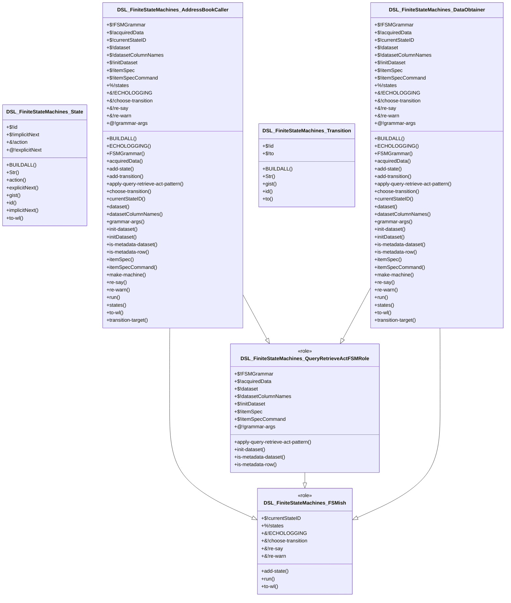

```mermaid
classDiagram
class DSL_FiniteStateMachines_State {
  +$!id
  +$!implicitNext
  +&!action
  +@!explicitNext
  +BUILDALL()
  +Str()
  +action()
  +explicitNext()
  +gist()
  +id()
  +implicitNext()
  +to-wl()
}


class DSL_FiniteStateMachines_AddressBookCaller {
  +$!FSMGrammar
  +$!acquiredData
  +$!currentStateID
  +$!dataset
  +$!datasetColumnNames
  +$!initDataset
  +$!itemSpec
  +$!itemSpecCommand
  +%!states
  +&!ECHOLOGGING
  +&!choose-transition
  +&!re-say
  +&!re-warn
  +@!grammar-args
  +BUILDALL()
  +ECHOLOGGING()
  +FSMGrammar()
  +acquiredData()
  +add-state()
  +add-transition()
  +apply-query-retrieve-act-pattern()
  +choose-transition()
  +currentStateID()
  +dataset()
  +datasetColumnNames()
  +grammar-args()
  +init-dataset()
  +initDataset()
  +is-metadata-dataset()
  +is-metadata-row()
  +itemSpec()
  +itemSpecCommand()
  +make-machine()
  +re-say()
  +re-warn()
  +run()
  +states()
  +to-wl()
  +transition-target()
}
DSL_FiniteStateMachines_AddressBookCaller --|> DSL_FiniteStateMachines_FSMish
DSL_FiniteStateMachines_AddressBookCaller --|> DSL_FiniteStateMachines_QueryRetrieveActFSMRole


class DSL_FiniteStateMachines_QueryRetrieveActFSMRole {
  <<role>>
  +$!FSMGrammar
  +$!acquiredData
  +$!dataset
  +$!datasetColumnNames
  +$!initDataset
  +$!itemSpec
  +$!itemSpecCommand
  +@!grammar-args
  +apply-query-retrieve-act-pattern()
  +init-dataset()
  +is-metadata-dataset()
  +is-metadata-row()
}
DSL_FiniteStateMachines_QueryRetrieveActFSMRole --|> DSL_FiniteStateMachines_FSMish


class DSL_FiniteStateMachines_Transition {
  +$!id
  +$!to
  +BUILDALL()
  +Str()
  +gist()
  +id()
  +to()
}


class DSL_FiniteStateMachines_FSMish {
  <<role>>
  +$!currentStateID
  +%!states
  +&!ECHOLOGGING
  +&!choose-transition
  +&!re-say
  +&!re-warn
  +add-state()
  +run()
  +to-wl()
}


class DSL_FiniteStateMachines_DataObtainer {
  +$!FSMGrammar
  +$!acquiredData
  +$!currentStateID
  +$!dataset
  +$!datasetColumnNames
  +$!initDataset
  +$!itemSpec
  +$!itemSpecCommand
  +%!states
  +&!ECHOLOGGING
  +&!choose-transition
  +&!re-say
  +&!re-warn
  +@!grammar-args
  +BUILDALL()
  +ECHOLOGGING()
  +FSMGrammar()
  +acquiredData()
  +add-state()
  +add-transition()
  +apply-query-retrieve-act-pattern()
  +choose-transition()
  +currentStateID()
  +dataset()
  +datasetColumnNames()
  +grammar-args()
  +init-dataset()
  +initDataset()
  +is-metadata-dataset()
  +is-metadata-row()
  +itemSpec()
  +itemSpecCommand()
  +make-machine()
  +re-say()
  +re-warn()
  +run()
  +states()
  +to-wl()
  +transition-target()
}
DSL_FiniteStateMachines_DataObtainer --|> DSL_FiniteStateMachines_FSMish
DSL_FiniteStateMachines_DataObtainer --|> DSL_FiniteStateMachines_QueryRetrieveActFSMRole
```